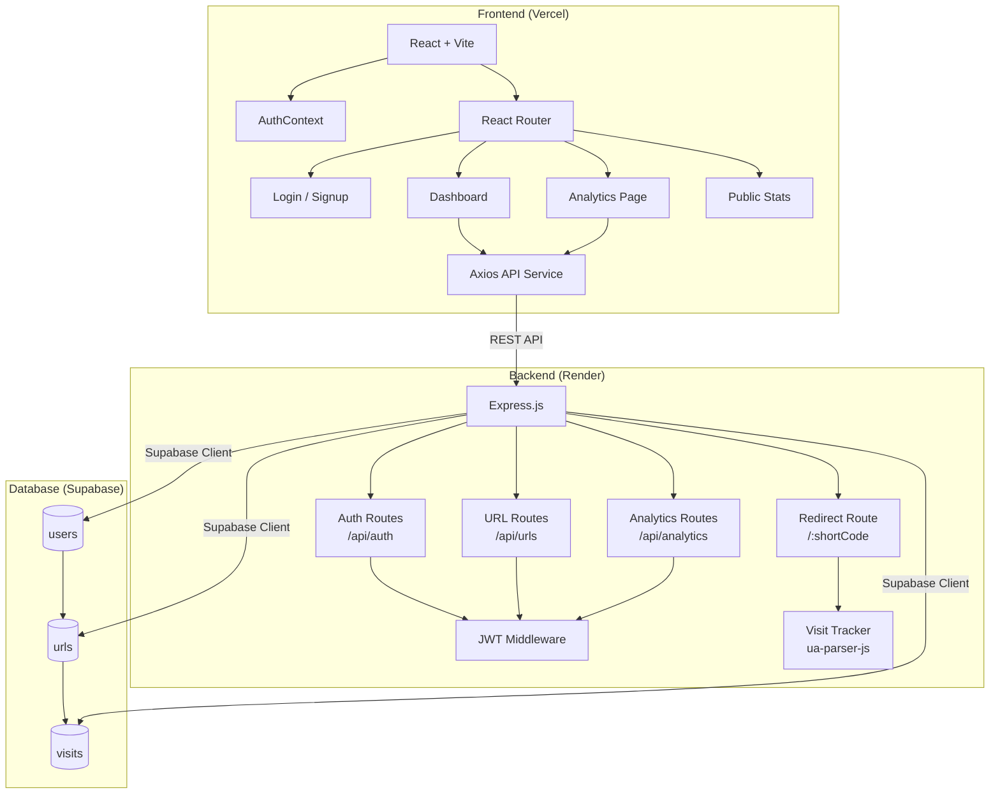

# SnapLink — URL Shortener with Analytics

> A production-ready full-stack URL shortener with click tracking, browser/device analytics, QR code generation, and a modern dark-mode SaaS dashboard.

---

## 📋 Project Overview

SnapLink allows authenticated users to:
- Shorten any valid URL into a compact short link
- Track every click with metadata (browser, device, OS, IP, timestamp)
- Visualise analytics with interactive charts
- Generate and download QR codes for any link
- Set custom aliases and optional expiry dates

---

## ✨ Features

### Mandatory
- ✅ **User Authentication** — Signup / Login with JWT + bcrypt password hashing
- ✅ **Protected Dashboard** — Only your links visible, JWT-guarded routes
- ✅ **URL Shortening** — Unique 6-char short codes, collision-safe generation
- ✅ **URL Validation** — Client and server side (must be http/https)
- ✅ **Server-side Redirect** — `GET /:shortCode` → 302 redirect
- ✅ **Dashboard** — View all links with original URL, short URL, date, click count
- ✅ **Copy URL** — One-click clipboard copy
- ✅ **Delete URL** — With ownership check
- ✅ **Analytics Page** — Total clicks, last visited, recent history, browser/device/OS charts
- ✅ **Responsive UI** — Mobile-first, tested at 375px and 1280px

### Bonus
- ✅ **Custom Alias** — Set your own short code (alphanumeric, 3-20 chars)
- ✅ **QR Code Generation** — Downloadable PNG QR code per link
- ✅ **Expiry Dates** — Links stop redirecting after set datetime
- ✅ **Public Stats Page** — `/stats/:shortCode` — no login required
- ✅ **Daily Click Trends** — 7-day and 30-day area charts with toggle
- ✅ **Device/Browser/OS Pie Charts** — Powered by Recharts

---

## 🛠 Tech Stack

| Layer | Technology |
|---|---|
| Frontend | React 18 + Vite |
| Styling | Tailwind CSS v4 |
| Routing | React Router v6 |
| HTTP | Axios |
| Notifications | React Hot Toast |
| Charts | Recharts |
| QR Code | qrcode.react |
| Backend | Node.js + Express.js |
| Auth | JWT (`jsonwebtoken`) + `bcryptjs` |
| DB | Supabase PostgreSQL |
| UA Parsing | `ua-parser-js` |
| ID Generation | `nanoid` |

---

## 🏗 Architecture Diagram



---

## 🗄 Database Schema

### `users`
```sql
id            UUID  PRIMARY KEY DEFAULT gen_random_uuid()
name          TEXT  NOT NULL
email         TEXT  UNIQUE NOT NULL
password_hash TEXT  NOT NULL
created_at    TIMESTAMPTZ DEFAULT NOW()
```

### `urls`
```sql
id           UUID        PRIMARY KEY DEFAULT gen_random_uuid()
user_id      UUID        NOT NULL REFERENCES users(id) ON DELETE CASCADE
original_url TEXT        NOT NULL
short_code   VARCHAR(50) UNIQUE NOT NULL
custom_alias VARCHAR(50) UNIQUE
expires_at   TIMESTAMPTZ
created_at   TIMESTAMPTZ DEFAULT NOW()
```

### `visits`
```sql
id          UUID        PRIMARY KEY DEFAULT gen_random_uuid()
url_id      UUID        NOT NULL REFERENCES urls(id) ON DELETE CASCADE
visited_at  TIMESTAMPTZ DEFAULT NOW()
ip_address  TEXT
browser     TEXT
device      TEXT
os          TEXT
```

---

## 📡 API Documentation

### Auth

| Method | Endpoint | Body | Response |
|---|---|---|---|
| POST | `/api/auth/signup` | `{ name, email, password }` | `{ user, token }` |
| POST | `/api/auth/login` | `{ email, password }` | `{ user, token }` |

### URLs _(requires `Authorization: Bearer <token>`_)

| Method | Endpoint | Body | Response |
|---|---|---|---|
| POST | `/api/urls` | `{ original_url, custom_alias?, expires_at? }` | `{ url }` |
| GET | `/api/urls` | — | `{ urls[] }` |
| DELETE | `/api/urls/:id` | — | `{ message }` |

### Analytics _(requires auth)_

| Method | Endpoint | Response |
|---|---|---|
| GET | `/api/analytics/:id` | Full analytics object with charts data |
| GET | `/api/analytics/public/:shortCode` | Public click count + last visited |

### Redirect _(public)_

| Method | Endpoint | Response |
|---|---|---|
| GET | `/:shortCode` | 302 redirect to original URL |

---

## 🚀 Installation & Setup

### Prerequisites
- Node.js ≥ 18
- A [Supabase](https://supabase.com) project (free tier works)

### 1. Clone the repository
```bash
git clone https://github.com/your-username/snaplink.git
cd snaplink
```

### 2. Set up the database
1. Go to your Supabase project → **SQL Editor**
2. Paste and run the contents of `backend/src/database/migrations/001_init.sql`

### 3. Configure the backend
```bash
cd backend
cp .env.example .env
# Fill in your values in .env
npm install
npm run dev
```

### 4. Configure the frontend
```bash
cd frontend
cp .env.example .env
# Set VITE_API_URL=http://localhost:5000
npm install
npm run dev
```

Open http://localhost:5173

---

## 🔐 Environment Variables

### Backend `.env`
```
PORT=5000
SUPABASE_URL=https://your-project.supabase.co
SUPABASE_ANON_KEY=your-anon-key
SUPABASE_SERVICE_ROLE_KEY=your-service-role-key
JWT_SECRET=your-super-secret-jwt-key-min-32-chars
BASE_URL=http://localhost:5000
FRONTEND_URL=http://localhost:5173
NODE_ENV=development
```

### Frontend `.env`
```
VITE_API_URL=http://localhost:5000
```

---

## 🌐 Deployment

### Backend → Render
1. Push `backend/` to a GitHub repo
2. Create a new **Web Service** on [Render](https://render.com)
3. Set **Build Command**: `npm install`
4. Set **Start Command**: `node index.js`
5. Add all environment variables from `.env.example`
6. Update `FRONTEND_URL` to your Vercel URL

### Frontend → Vercel
1. Push `frontend/` to GitHub
2. Import on [Vercel](https://vercel.com)
3. Set `VITE_API_URL` = your Render backend URL
4. Deploy — Vercel auto-detects Vite

---

## 📸 Screenshots

_Add screenshots here after deployment_

| Page | Description |
|---|---|
| Home | Landing page with hero and feature grid |
| Dashboard | URL management with stats overview |
| Analytics | Charts, visit table, browser/device breakdown |
| Login/Signup | Auth forms with validation |

---

## 💡 Assumptions Made

1. **Short code default length** is 6 alphanumeric characters (nanoid), retrying up to 10 times on collision
2. **Redirect** issues HTTP 302 (not 301) to prevent browser caching in development/testing
3. **IP detection** uses `X-Forwarded-For` header (standard on Render/proxied deployments)
4. **JWT expiry** is 7 days; refresh tokens are out of scope for this hackathon
5. **Supabase service-role key** is used backend-only — never exposed to the browser
6. **RLS (Row Level Security)** is not configured on Supabase tables because all DB access goes through the backend using the service-role key
7. **Visit tracking** is fire-and-forget (async) on the redirect route to keep redirect latency minimal
8. **Public analytics** (`/stats/:shortCode`) returns only click count and last visited — not raw visit data — for privacy
9. **Delete** cascades to visits via `ON DELETE CASCADE` in the schema
10. **Custom alias** replaces the auto-generated short code (not stored separately)

---

## 🤖 AI Planning Document

This project was planned and built using AI-assisted code generation. The workflow:

1. **Read problem statement** → extracted all mandatory and bonus requirements
2. **Architecture design** → chose React + Express + Supabase for rapid full-stack development
3. **Schema design** → modelled `users`, `urls`, `visits` with proper foreign keys and indexes
4. **Backend first** → clean architecture with controllers/services/routes separation
5. **Frontend second** → context → services → components → pages
6. **Bonus features** → custom alias, QR code, expiry, public stats added as layered enhancements

---

> This project is a part of a hackathon run by https://katomaran.com
