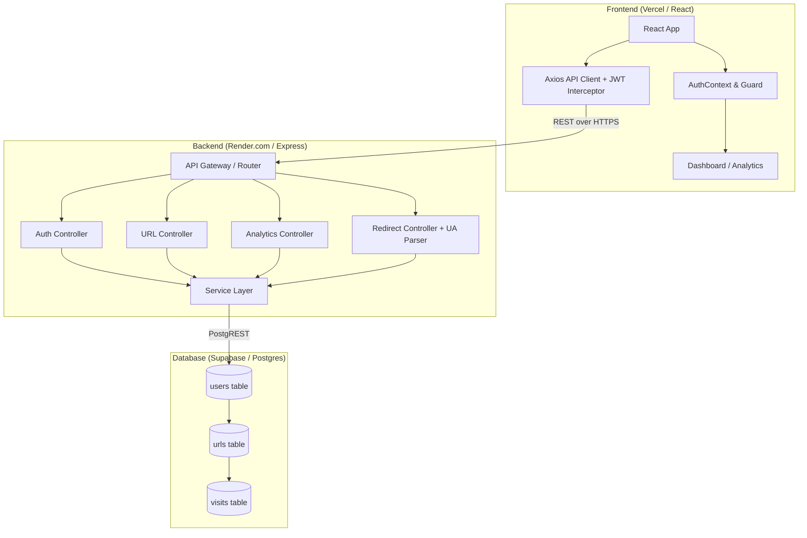

# 🚀 SnapLink — Advanced URL Shortener & Analytics Platform

> **Live Demo:** [https://url-shortener-analytics-psi.vercel.app](https://url-shortener-analytics-psi.vercel.app)  
> **Demo Video:** https://www.loom.com/share/b09ef435041e4816b01c6f792a111056 

A production-ready full-stack SaaS application built for the Katomaran Hackathon. It provides secure URL shortening, detailed click tracking (browser, OS, device, IP), interactive charting, and custom aliases.

---

## 🏆 Hackathon Requirements Checklist

This project was built to strictly adhere to the Katomaran Hackathon Problem Statement. Here is how the requirements were met:

### Mandatory Requirements
- [x] **Frontend Stack**: Built with React (Vite), Tailwind CSS v4, and React Router.
- [x] **Backend Stack**: Built with Node.js and Express.js using clean layered architecture.
- [x] **Database**: Powered by Supabase (PostgreSQL) using proper relational schemas (`users`, `urls`, `visits`).
- [x] **Authentication**: Custom JWT implementation with `bcryptjs` for secure password hashing.
- [x] **Protected Routes**: React Context + Guard components ensure users only access their own links.
- [x] **URL Shortening**: Collision-safe 6-character generation (`nanoid`) with HTTP/HTTPS validation.
- [x] **Redirection**: HTTP `302` redirects capturing metadata before routing.
- [x] **Dashboard UI**: Modern glassmorphism aesthetic with URL listing, creation, and deletion.
- [x] **Analytics UI**: Integrated `Recharts` for visually stunning 7-day/30-day area trends and pie charts.
- [x] **AI Workflow Documentation**: Fully planned and coded using AI-assisted workflow (see AI section below).

### Bonus Features Implemented
- [x] **Custom Aliases**: Users can define their own branded short URLs (e.g., `snap.link/my-brand`).
- [x] **QR Code Generation**: Instantly generates downloadable PNG QR codes using `qrcode.react`.
- [x] **Link Expiry Dates**: Users can set an expiration time; expired links return a 410 error.
- [x] **Public Stats Page**: Shareable public link (`/stats/:shortCode`) to show off click counts securely.

---

## 🛠 Tech Stack

| Layer | Technology |
|---|---|
| **Frontend** | React 18, Vite, Tailwind CSS v4, React Router v6 |
| **Data Viz** | Recharts (Area & Pie charts) |
| **Backend** | Node.js, Express.js, JWT, bcryptjs |
| **Database** | Supabase (PostgreSQL) |
| **Utilities** | Axios, React Hot Toast, `ua-parser-js`, `nanoid` |
| **Deployment** | Vercel (Frontend), Render.com (Backend) |

---

## 🏗 Architecture & Data Flow



---

## 🗄 Database Schema

**1. Users Table**
```sql
id (UUID, PK), name (TEXT), email (TEXT, UNIQUE), password_hash (TEXT), created_at (TIMESTAMPTZ)
```

**2. URLs Table**
```sql
id (UUID, PK), user_id (UUID, FK -> users), original_url (TEXT), short_code (VARCHAR), custom_alias (VARCHAR), expires_at (TIMESTAMPTZ), created_at (TIMESTAMPTZ)
```

**3. Visits Table** (Records every individual click)
```sql
id (UUID, PK), url_id (UUID, FK -> urls), visited_at (TIMESTAMPTZ), ip_address (TEXT), browser (TEXT), device (TEXT), os (TEXT)
```

---

## 🚀 Local Setup Instructions

### Prerequisites
- Node.js ≥ 18
- A Supabase Project (for PostgreSQL)

### 1. Clone & Database Setup
```bash
git clone https://github.com/rethanyaG18/url-shortener-analytics.git
cd url-shortener-analytics
```
*Run the SQL found in `backend/src/database/migrations/001_init.sql` inside your Supabase SQL Editor.*

### 2. Run Backend
```bash
cd backend
npm install
# Create a .env file using the provided .env.example
npm run dev
```

### 3. Run Frontend
```bash
cd frontend
npm install
# Ensure .env has VITE_API_URL=http://localhost:5000
npm run dev
```

Visit `http://localhost:5173` in your browser.

---

## 💡 Assumptions & Design Decisions

1. **Short code length**: Defaults to 6 characters. The system retries up to 10 times in the highly unlikely event of a collision.
2. **Redirect Status**: Issues `HTTP 302` (Temporary) rather than `301` (Permanent) so browsers do not cache the redirect. This ensures every click is tracked accurately.
3. **CORS Policy**: Configured to dynamically accept requests from the deployed Vercel frontend, preventing strict origin mismatch blocks.
4. **Delete Cascade**: Deleting a URL automatically deletes all associated visits via `ON DELETE CASCADE` in PostgreSQL.
5. **Security**: Supabase connection uses the backend `service-role` key. The frontend never communicates with Supabase directly, acting entirely through the Express backend gatekeeper.

---

## 🤖 AI Planning & Workflow Document

This project was built using an advanced AI-assisted workflow:
1. **Requirements Extraction**: The problem statement PDF was ingested, breaking down all mandatory vs. bonus requirements.
2. **Architecture Blueprinting**: The relational database schema and API route structures were mapped out before writing code.
3. **Backend First**: The Express backend was built layer-by-layer (Routes -> Controllers -> Services), testing collision logic and JWT middleware.
4. **Frontend Implementation**: The Vite/React environment was scaffolded, implementing Context API for global auth state, followed by UI components.
5. **Polish & Analytics**: Recharts was integrated, mapping complex PostgreSQL aggregation queries into beautiful frontend data visualisations.

---

> This project is a part of a hackathon run by https://katomaran.com
